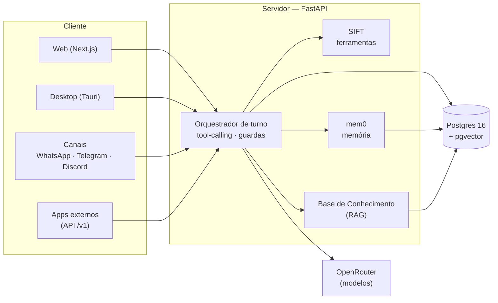

<div align="center">

# AI Workspace

**Um workspace de IA self-hosted e local-first — chat multi-modelo com ferramentas, memória de longo prazo, automações, integrações e um app desktop, tudo rodando na _sua_ infraestrutura.**

[](#arquitetura)
[](#arquitetura)
[](#in%C3%ADcio-r%C3%A1pido)
[-6f42c1)](docs/desktop.md)

</div>

---

O **AI Workspace** é uma plataforma de IA no estilo OpenWebUI, pensada para ser **dona dos
próprios dados**: você conversa com qualquer modelo, dá a ele ferramentas e memória, cria
automações e integra com seus serviços — e nada disso sai da sua máquina, exceto a chamada ao
provedor de modelos e o que **você** mandar as ferramentas fazerem. Segredos ficam
**criptografados em repouso** no banco.

Não é um wrapper de chat. É uma stack completa: orquestrador de turno com tool-calling,
memória vetorial, base de conhecimento (RAG), automações agendadas, canais de mensagem
(WhatsApp/Telegram/Discord), API pública compatível com OpenAI, observabilidade fim-a-fim e
um app desktop com bandeja.

> **Stack:** [FastAPI](https://fastapi.tiangolo.com/) (async) · [SQLAlchemy 2](https://www.sqlalchemy.org/) ·
> **Postgres 16 + [pgvector](https://github.com/pgvector/pgvector)** · [Next.js 14](https://nextjs.org/) (App Router) + Tailwind ·
> [SIFT](https://github.com/Victor-Alves0/SIFT) (tool calling) · [mem0](https://github.com/mem0ai/mem0) (memória) ·
> [OpenRouter](https://openrouter.ai/) · tudo em **Docker Compose**.

## Sumário

- [Destaques](#destaques)
- [Recursos](#recursos)
- [Arquitetura](#arquitetura)
- [Início rápido](#início-rápido)
- [Serviços opcionais](#serviços-opcionais)
- [App desktop](#app-desktop-windows)
- [Documentação](#documentação)
- [Segurança](#segurança)
- [Desenvolvimento](#desenvolvimento)
- [Licença](#licença)

## Destaques

- 🔒 **Self-hosted e local-first.** Roda inteiro em Docker Compose. A única saída externa é o
  provedor de modelos e o que suas ferramentas acessarem. Chaves ficam cifradas no banco.
- 🧠 **Modelos personalizados.** Prompt, parâmetros, ferramentas, capacidades, filtros, voz,
  memória e sub-agentes — configuráveis **por modelo**, como um "GPT" próprio.
- 🛠️ **Ferramentas de verdade.** Pesquisa na web, leitura de página, navegador headless,
  gráficos, cotações, Gmail/Agenda, casa inteligente, GitHub, e **código Python que você
  escreve**, rodando num sandbox isolado.
- ♾️ **Memória de longo prazo** com escopos (global / por modelo / por chat) e bancos
  compartilháveis, mais uma **base de conhecimento (RAG)** com pgvector.
- ⚡ **Automações** agendadas e monitores (preço, página, busca, RSS) que te avisam no
  app, no navegador (push) ou nos canais.
- 💬 **Canais de mensagem.** Converse com seus modelos por **WhatsApp, Telegram e Discord** —
  cada conversa vira um chat na barra lateral.
- 🔌 **API pública compatível com OpenAI** (`/v1/chat/completions`), com chaves por usuário,
  limites, cotas, controle de custo e memória por chave.
- 📊 **Observabilidade fim-a-fim** — cada requisição vira um _trace_ com latência, tempo de
  banco, leituras/escritas e chamadas de LLM, num painel com waterfall.
- 🖥️ **App desktop (Windows)** com ícone na bandeja, "rodar em segundo plano" e "iniciar com
  o Windows".

## Recursos

<table>
<tr><td valign="top" width="50%">

**Chat & modelos**
- Chat multi-modelo via OpenRouter (qualquer modelo compatível com OpenAI) e **modelos
  locais via Ollama**
- Streaming retomável (F5/fechar não cancela) com botão de **parar**
- **Modelos personalizados** com prompt, parâmetros, tools, voz e memória próprios
- **Mesa-redonda**: vários modelos conversando entre si, com você guiando
- **Sub-agentes**: um orquestrador delega a modelos-operário (sequencial/paralelo)
- **Chat temporário**, **compactação** de contexto não-destrutiva e **chats de referência**

**Ferramentas (SIFT)**
- Pesquisa na web (DuckDuckGo/SearXNG/Tavily/Brave) e **pesquisa profunda**
- Leitura de página e **navegador headless** (Chromium controlado pela IA)
- Gráficos, diagramas (Mermaid/Excalidraw), cotações financeiras, data/hora
- **Transcrição de vídeo/áudio** (YouTube + ~1800 sites)
- **Código Python** escrito pela IA, executado em **sandbox isolado**

**Conteúdo & mídia**
- **Artefatos** (código/docs/HTML/SVG/Mermaid/CSV) em janela dedicada, com versões
- **Geração de imagens** (nativa ou via roteador) e vídeo (Higgsfield)
- **Voz** TTS/STT compatível com OpenAI, incl. **Kokoro** local e clonagem

</td><td valign="top" width="50%">

**Memória & conhecimento**
- **Memória (mem0)** com escopos global/modelo/chat e bancos compartilháveis
- **Base de Conhecimento (RAG)** — suba documentos, busca por pgvector, citações
- **Second brain**: notas interligadas com grafo; a IA propõe skills e memórias
- **Aprendizado proativo**: revisão em background sugere skills/memórias (com aprovação)

**Automação & canais**
- **Automações** agendadas + **monitores** (preço/página/busca/RSS)
- Notificação in-app, **Web Push** e entrega nos canais
- **WhatsApp** (Evolution/QR ou Cloud API), **Telegram** e **Discord**

**Plataforma & operação**
- **API pública** compatível com OpenAI + gestão de chaves, limites e custos
- **Observabilidade** (traces/spans) e **Analítica** de uso (tokens/custo)
- **Codespace**: clone de repositório + grafo de código + editor
- **Playground**: benchmarks, comparações e debug de ferramentas
- **Segurança**: 2FA (TOTP), logs de auditoria, rotação de `APP_SECRET`
- **App desktop**, **PWA/mobile**, paleta de comandos, atalhos de teclado

</td></tr>
</table>

> A lista completa e detalhada está em **[docs/features.md](docs/features.md)**.

## Arquitetura



O código está organizado como um monorepo:

```
apps/server    FastAPI — auth, orquestrador de chat, SIFT, mem0, RAG, integrações, API /v1
apps/web       Next.js (App Router) — interface de chat, workspace, configurações
desktop        Shell desktop (Tauri) — janela nativa, bandeja, autostart
infra/         Configs de serviços opcionais (SearXNG etc.)
```

Serviços do Docker Compose:

| Serviço     | Padrão | Porta (host) | Como ligar                                       |
|-------------|:------:|:------------:|--------------------------------------------------|
| `db`        | ✅     | interna      | Postgres 16 + pgvector (dados + vetores)         |
| `server`    | ✅     | `8000`       | API FastAPI                                       |
| `web`       | ✅     | `3000`       | Interface Next.js                                 |
| `searxng`   | opt-in | `8080`       | `docker compose --profile search up -d`          |
| `kokoro`    | opt-in | `8880`       | `docker compose --profile voice up -d`           |
| `evolution` | opt-in | `8081`       | `docker compose --profile whatsapp up -d`        |
| `browser`   | opt-in | `3009`       | `docker compose --profile browser up -d`         |

Detalhes em **[docs/architecture.md](docs/architecture.md)**.

## Início rápido

**Pré-requisitos:** [Docker](https://docs.docker.com/get-docker/) + Docker Compose.

```bash
git clone https://github.com/Victor-Alves0/AI-Workspace.git
cd AI-Workspace
cp .env.example .env

# gere um segredo forte e cole em APP_SECRET no .env:
python -c "import secrets; print(secrets.token_urlsafe(48))"

docker compose up -d --build
```

Abra **http://localhost:3000**. O **primeiro usuário cadastrado vira admin**. Depois, em
**⚙ Configurações → Conexões → APIs**, cole sua **chave do [OpenRouter](https://openrouter.ai/keys)**
(fica cifrada), escolha um modelo e converse.

> As migrações do banco (Alembic) **rodam sozinhas** no startup do servidor. Para atualizar
> depois, rode `./update.sh` (ou `git pull && docker compose up -d --build`).

Vai acessar pela **rede local ou por uma VPS**, com **domínio + HTTPS**, ou precisa de
**backup/restore**? Está tudo em **[docs/deployment.md](docs/deployment.md)**.

## Serviços opcionais

Recursos pesados sobem sob demanda via _profiles_ do Compose:

```bash
# Pesquisa na web self-hosted (SearXNG, sem chave de API)
docker compose --profile search up -d searxng

# Voz local (Kokoro-FastAPI, TTS compatível com OpenAI)
docker compose --profile voice up -d kokoro

# WhatsApp não oficial (Evolution API, QR Code)
docker compose --profile whatsapp up -d

# Navegador headless (Chromium via browserless) para a tool de navegação
docker compose --profile browser up -d
```

## App desktop (Windows)

Um app nativo que abre a interface numa janela própria, com **ícone na bandeja**, **"rodar em
segundo plano"** e **"iniciar com o Windows"**.

**⬇️ Baixe o instalador na página de [Releases](https://github.com/Victor-Alves0/AI-Workspace/releases/latest)**
(arquivo `AI.Workspace_x64-setup.exe`, compilado pelo CI a cada versão).

Nesta versão o app **não** embarca o servidor — deixe o stack no ar (`docker compose up -d`) e
abra o app. Guia completo em **[docs/desktop.md](docs/desktop.md)**.

## Documentação

| Documento | Conteúdo |
|-----------|----------|
| [docs/features.md](docs/features.md)         | Catálogo completo de recursos |
| [docs/architecture.md](docs/architecture.md) | Visão de sistema, componentes e o fluxo de um turno |
| [docs/configuration.md](docs/configuration.md) | Referência de todas as variáveis de ambiente |
| [docs/deployment.md](docs/deployment.md)     | VPS, LAN, HTTPS, backup/restore, atualização, rotação de segredo |
| [docs/public-api.md](docs/public-api.md)     | API compatível com OpenAI + gestão de chaves |
| [docs/security.md](docs/security.md)         | Modelo de segurança e recomendações |
| [docs/desktop.md](docs/desktop.md)           | App desktop (Tauri) |
| [docs/development.md](docs/development.md)    | Rodar sem Docker, testes, layout do projeto |
| [CONTRIBUTING.md](CONTRIBUTING.md)           | Como contribuir |

## Segurança

- Senhas com **Argon2**; sessão via **JWT em cookie httpOnly** (access + refresh rotativo) com
  `token_version` para revogar todas as sessões; **2FA (TOTP)** opcional.
- Segredos por usuário cifrados com **Fernet** (chave derivada do `APP_SECRET`), com
  ferramenta de **rotação** que re-cifra o banco.
- **CORS** restrito às origens de `WEB_ORIGIN`; cabeçalhos de segurança em todas as respostas;
  **HSTS** sob HTTPS; **rate limiting** em login/registro e na API pública.
- **Sandbox de ferramentas**: o código roda em subprocesso isolado com limites de CPU/memória.
- Em `APP_ENV=production`, o servidor **recusa iniciar** com `APP_SECRET` fraco.

Detalhes e o modelo de ameaça em **[docs/security.md](docs/security.md)**. Encontrou uma
vulnerabilidade? Veja [SECURITY.md](SECURITY.md).

## Desenvolvimento

Guia de setup local (sem Docker), testes e organização do código em
**[docs/development.md](docs/development.md)**. Para contribuir, comece pelo
**[CONTRIBUTING.md](CONTRIBUTING.md)**.

## Licença

> ⚠️ **Este repositório ainda não define uma licença.** Sem um arquivo `LICENSE`, o padrão
> legal é "todos os direitos reservados": terceiros não têm permissão de uso, cópia ou
> modificação. Se a intenção é abrir o projeto, adicione uma licença
> ([escolha aqui](https://choosealicense.com/)) — MIT/Apache-2.0 para permissivo, AGPL-3.0
> para copyleft forte (comum em apps self-hosted).
