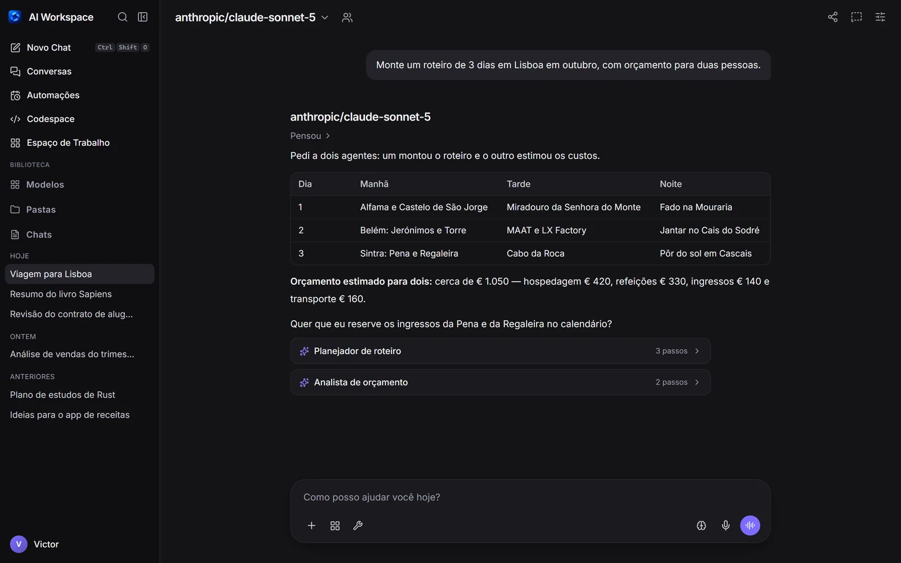
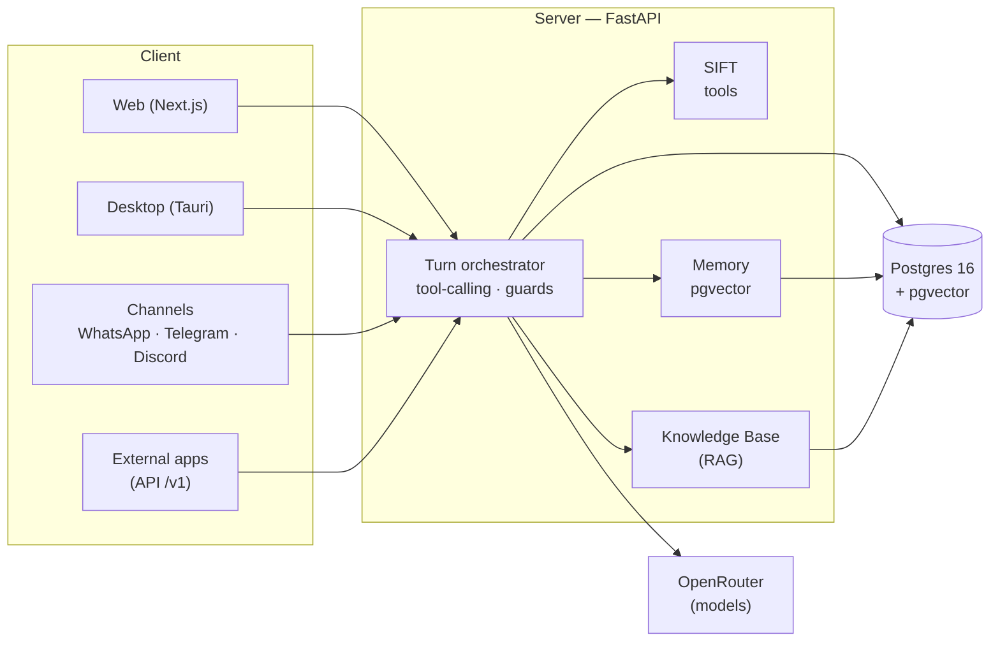
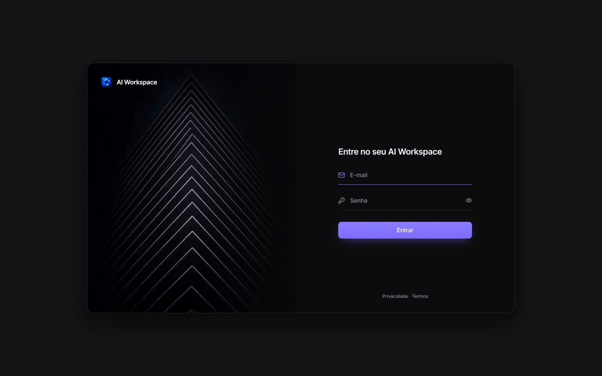

<div align="center">

# AI Workspace

**A self-hosted, local-first AI workspace — multi-model chat with tools, long-term memory, automations, integrations and a desktop app, all running on _your_ infrastructure.**

[](https://github.com/Victor-Alves0/AI-Workspace/releases/latest)
[](LICENSE)
[](https://github.com/Victor-Alves0/AI-Workspace/actions/workflows/tests.yml)
[](https://github.com/Victor-Alves0/AI-Workspace/stargazers)
[](https://github.com/Victor-Alves0/AI-Workspace/discussions)

[](#architecture)
[](#architecture)
[](#quick-start)
[-6f42c1)](docs/desktop.md)

<br>



</div>

---

**AI Workspace** is an OpenWebUI-style AI platform built to **own its own data**: you chat with
any model, give it tools and memory, create automations and integrate with your services — and
none of it leaves your machine except the call to the model provider and whatever **you** tell
the tools to do. Secrets are stored **encrypted at rest** in the database.

It's not a chat wrapper. It's a full stack: a turn orchestrator with tool-calling, vector
memory, a knowledge base (RAG), scheduled automations, messaging channels
(WhatsApp/Telegram/Discord), an OpenAI-compatible public API, end-to-end observability and a
desktop app with a tray icon.

> **Stack:** [FastAPI](https://fastapi.tiangolo.com/) (async) · [SQLAlchemy 2](https://www.sqlalchemy.org/) ·
> **Postgres 16 + [pgvector](https://github.com/pgvector/pgvector)** · [Next.js 16](https://nextjs.org/) (App Router) + Tailwind ·
> [SIFT](https://github.com/Victor-Alves0/SIFT) (tool calling) ·
> [OpenRouter](https://openrouter.ai/) · all in **Docker Compose**.

## Table of contents

- [Highlights](#highlights)
- [Features](#features)
- [Architecture](#architecture)
- [Quick start](#quick-start)
- [Optional services](#optional-services)
- [Desktop app](#desktop-app-windows)
- [Documentation](#documentation)
- [Security](#security)
- [Development](#development)
- [Community](#community)
- [License](#license)

## Highlights

- 🔒 **Self-hosted and local-first.** Runs entirely in Docker Compose. The only external egress
  is the model provider and whatever your tools reach. Keys are encrypted in the database.
- 🧠 **Custom models.** Prompt, parameters, tools, capabilities, filters, voice, memory and
  sub-agents — all configurable **per model**, like your own "GPT".
- 🤖 **Sub-agents, Claude Code style.** The AI delegates to agents you configured **or creates
  its own** for the task, runs them in parallel or **in the background**, and shows each agent's
  steps and report in the chat.
- 🛠️ **Real tools.** Web search, page reading, headless browser, charts, quotes, Gmail/Calendar,
  smart home, GitHub, and **Python code you write**, running in an isolated sandbox.
- ♾️ **Long-term memory** with scopes (global / per model / per chat) and shareable stores, plus
  a **knowledge base (RAG)** with pgvector.
- ⚡ **Automations** — schedules and monitors (price, page, search, RSS) that notify you in the
  app, in the browser (push) or through the channels.
- 💬 **Messaging channels.** Talk to your models over **WhatsApp, Telegram and Discord** — each
  conversation becomes a chat in the sidebar.
- 🔌 **OpenAI-compatible public API** (`/v1/chat/completions`), with per-user keys, limits,
  quotas, cost control and per-key memory.
- 📊 **End-to-end observability** — every request becomes a _trace_ with latency, database time,
  reads/writes and LLM calls, in a waterfall panel.
- 🖥️ **Desktop app (Windows)** with a tray icon, "run in the background" and "start with
  Windows".

## Features

<table>
<tr><td valign="top" width="50%">

**Chat & models**
- Multi-model chat via OpenRouter (any OpenAI-compatible model) and **local models via Ollama**
- Resumable streaming (F5/close doesn't cancel) with a **stop** button
- **Custom models** with their own prompt, parameters, tools, voice and memory
- **Round table**: several models talking to each other, with you steering
- **Sub-agents**: delegate to your agents or let the AI create its own; parallel, background
  and isolated git worktrees, with each agent's work visible in the chat
- **Temporary chat**, non-destructive context **compaction** and **reference chats**

**Tools (SIFT)**
- Web search (built-in metasearch over several engines, Tavily or Brave) and **deep search**
- Page reading and **headless browser** (AI-controlled Chromium)
- Charts, diagrams (Mermaid/Excalidraw), financial quotes, date/time
- **Video/audio transcription** (YouTube + ~1800 sites)
- **Python code** written by the AI, executed in an **isolated sandbox**
- **Remote Terminal**: a real shell on **your own machines** (VPS, home server) through an
  installed agent, with outbound traffic optionally sealed through a proxy + killswitch

**Content & media**
- **Artifacts** (code/docs/HTML/SVG/Mermaid/CSV) in a dedicated window, with versions
- **Image generation** (native or via a router) and video (Higgsfield)
- **Voice** built-in local TTS (Kokoro, no extra service) plus any OpenAI-compatible TTS/STT, incl. voice cloning

</td><td valign="top" width="50%">

**Memory & knowledge**
- **Memory** with global/model/chat scopes and shareable stores
- **Knowledge Base (RAG)** — upload documents, pgvector search, citations
- **Second brain**: interlinked notes with a graph; the AI proposes skills and memories
- **Proactive learning**: a background review suggests skills/memories (with approval)

**Automation & channels**
- **Automations** (schedules) + **monitors** (price/page/search/RSS)
- In-app notifications, **Web Push** and delivery through channels
- **WhatsApp** (built-in QR pairing or Cloud API), **Telegram** and **Discord**

**Platform & operations**
- **OpenAI-compatible public API** + key management, limits and costs
- **Observability** (traces/spans) and usage **Analytics** (tokens/cost)
- **Codespace**: repository clone + code graph + editor
- **Playground**: benchmarks, comparisons and tool debugging
- **Security**: 2FA (TOTP), audit logs, `APP_SECRET` rotation
- **Desktop app**, **PWA/mobile**, command palette, keyboard shortcuts

</td></tr>
</table>

> The full, detailed list is in **[docs/features.md](docs/features.md)**.

## Architecture



The code is organized as a monorepo:

```
apps/server    FastAPI — auth, chat orchestrator, SIFT, memory, RAG, integrations, /v1 API
apps/web       Next.js (App Router) — chat interface, workspace, settings
desktop        Desktop shell (Tauri) — native window, tray, autostart
infra/         Updater sidecar, proxy and optional service configs
```

Docker Compose services:

| Service     | Default | Port (host) | How to enable                                    |
|-------------|:-------:|:-----------:|--------------------------------------------------|
| `db`        | ✅      | internal    | Postgres 16 + pgvector (data + vectors)          |
| `server`    | ✅      | `8000`      | FastAPI API                                       |
| `web`       | ✅      | `41414`     | Next.js interface                                 |
| `updater`   | ✅      | internal    | Applies "Update now" from the admin panel         |
| `browser`   | opt-in  | `3009`      | `docker compose --profile browser up -d`         |

Details in **[docs/architecture.md](docs/architecture.md)**.

## Quick start

**Prerequisites:** [Docker](https://docs.docker.com/get-docker/) + Docker Compose.

### One-command install (Linux/macOS)

The installer clones the repository, generates strong local secrets, creates `.env` and starts
the core stack. Existing `.env` files are preserved.

```bash
curl -fsSL https://raw.githubusercontent.com/Victor-Alves0/AI-Workspace/main/install.sh | bash
```

To choose another destination, use
`curl -fsSL https://raw.githubusercontent.com/Victor-Alves0/AI-Workspace/main/install.sh | AI_WORKSPACE_DIR=/path/to/ai-workspace bash`.
Review the script before piping it to Bash if this is a production server.

### Manual install

```bash
git clone https://github.com/Victor-Alves0/AI-Workspace.git
cd AI-Workspace
cp .env.example .env

# generate a strong secret and paste it into APP_SECRET in .env:
python -c "import secrets; print(secrets.token_urlsafe(48))"

docker compose up -d --build
```

Open **https://localhost** (the browser warns about the certificate on the first visit — the
stack issues its own; see [docs/https.md](docs/https.md)). A **first-run wizard** creates your
admin account and asks whether other people may sign up; then the in-app setup asks for your
**[OpenRouter](https://openrouter.ai/keys) key** (stored encrypted) and a model, and you're
chatting.

<p align="center"></p>

> Database migrations (Alembic) **run automatically** on server startup. To update later, run
> `./update.sh` (or `git pull && docker compose up -d --build`).

Accessing over the **local network or a VPS**, with a **domain + HTTPS**, or need
**backup/restore**? It's all in **[docs/deployment.md](docs/deployment.md)**.

## Optional services

Heavy features come up on demand via Compose _profiles_:

```bash
# Headless browser (Chromium via browserless) for the browsing tool
docker compose --profile browser up -d
```

## Desktop app (Windows)

The whole AI Workspace in a native Windows app — **no Docker, no server to run**. The installer
ships the database (Postgres + pgvector) and the backend; everything runs on one local port, with
a **tray icon**, **"run in the background"**, **"start with Windows"** and in-app updates.

**⬇️ Download the installer from the [Releases](https://github.com/Victor-Alves0/AI-Workspace/releases/latest) page**
(file `AI.Workspace_x.y.z_x64-setup.exe`, built by CI on every release). Installing over an
existing version updates it in place and keeps your data. Full guide in
**[docs/desktop.md](docs/desktop.md)**.

## Documentation

| Document | Contents |
|----------|----------|
| [docs/features.md](docs/features.md)         | Full feature catalog |
| [docs/architecture.md](docs/architecture.md) | System view, components and the lifecycle of a turn |
| [docs/configuration.md](docs/configuration.md) | Reference for every environment variable |
| [docs/deployment.md](docs/deployment.md)     | VPS, LAN, HTTPS, backup/restore, updates, secret rotation |
| [docs/public-api.md](docs/public-api.md)     | OpenAI-compatible API + key management |
| [docs/security.md](docs/security.md)         | Security model and recommendations |
| [docs/remote-terminal.md](docs/remote-terminal.md) | Remote Terminal: agent, egress proxy and killswitch |
| [docs/desktop.md](docs/desktop.md)           | Desktop app (Tauri) |
| [docs/development.md](docs/development.md)    | Running without Docker, tests, project layout |
| [CONTRIBUTING.md](CONTRIBUTING.md)           | How to contribute |

## Security

- Passwords with **Argon2**; sessions via **JWT in an httpOnly cookie** (access + rotating
  refresh) with `token_version` to revoke all sessions; optional **2FA (TOTP)**.
- Per-user secrets encrypted with **Fernet** (key derived from `APP_SECRET`), with a
  **rotation** tool that re-encrypts the database.
- **CORS** restricted to the origins in `WEB_ORIGIN`; security headers on every response;
  **HSTS** under HTTPS; **rate limiting** on login/registration and on the public API.
- **Tool sandbox**: code runs in an isolated subprocess with CPU/memory limits.
- Under `APP_ENV=production`, the server **refuses to start** with a weak `APP_SECRET`.

Details and the threat model in **[docs/security.md](docs/security.md)**. Found a vulnerability?
See [SECURITY.md](SECURITY.md).

## Development

Local setup guide (without Docker), tests and code organization in
**[docs/development.md](docs/development.md)**. To contribute, start with
**[CONTRIBUTING.md](CONTRIBUTING.md)**.

## Community

AI Workspace is built in the open and contributions of every size are welcome.

- 💬 **Questions, ideas and show-and-tell:** [GitHub Discussions](https://github.com/Victor-Alves0/AI-Workspace/discussions)
- 🐛 **Bugs and feature requests:** [open an issue](https://github.com/Victor-Alves0/AI-Workspace/issues/new/choose)
- 🌱 **First contribution?** Look for [`good first issue`](https://github.com/Victor-Alves0/AI-Workspace/labels/good%20first%20issue)
  and read [CONTRIBUTING.md](CONTRIBUTING.md)
- 🌍 **Language:** the interface is currently in **Portuguese (pt-BR)**; English and other
  translations are one of the most wanted contributions
- ⭐ If AI Workspace is useful to you, a star helps other people find it

Everyone taking part is expected to follow the [Code of Conduct](CODE_OF_CONDUCT.md).

## License

AI Workspace is licensed under the **[GNU Affero General Public License v3.0](LICENSE)**
(AGPL-3.0). You can use, study, modify and self-host it freely; if you run a **modified** version
as a network service for other people, you must make your changes available under the same
license.
