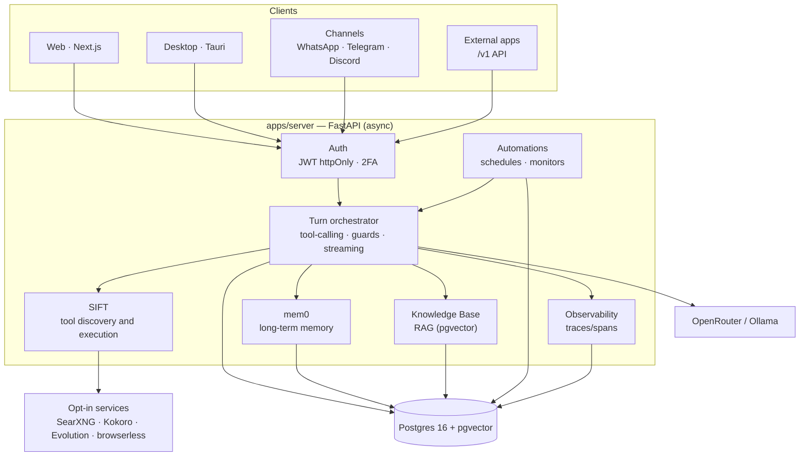
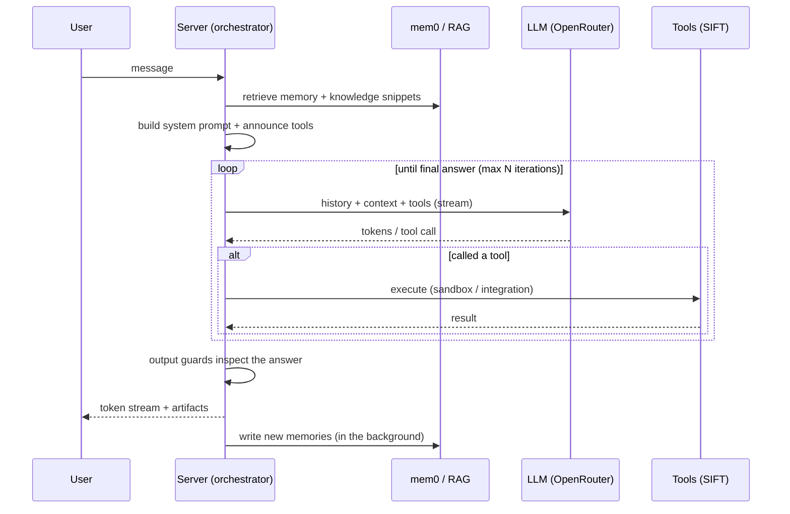

# Architecture

Singularity AI is a monorepo with a **FastAPI backend** (async), a **Next.js frontend** and a
**Tauri desktop shell**, orchestrated by **Docker Compose** and backed by **Postgres 16 with
pgvector** for both relational and vector data.

## Overview

## Components

### Backend (`apps/server`)

Async FastAPI, served by Uvicorn. Responsibilities:

- **Authentication and session** — Argon2 for passwords, JWT in an httpOnly cookie (access +
  rotating refresh), optional TOTP 2FA, admin/user RBAC.
- **Turn orchestrator** (`chat/orchestrator.py`) — assembles the context (memory + RAG +
  reference chats), announces the tools, runs the agentic tool-calling loop, applies the
  **output guards** and emits the streaming events. It runs decoupled from the request: F5 or
  closing the browser does not cancel generation.
- **SIFT** — tool-calling library (3 meta-tools: search, execute, run code). Native tools are
  injected directly; the catalog is discovered on demand to save tokens.
- **mem0** — long-term memory with scopes (global/model/chat) and shareable stores, using the
  same Postgres + pgvector as the vector store.
- **Knowledge Base (RAG)** — documents indexed with FastEmbed (384 dim) in pgvector; automatic
  mode (injects snippets + cites) or tool mode (`search_knowledge`).
- **Integrations** — Google (Gmail/Calendar), Tuya/Smart Life, GitHub, and the channels
  (WhatsApp/Telegram/Discord).
- **Public API** (`/v1`) — OpenAI-compatible endpoints + key management.
- **Observability** — every request becomes a trace; spans measure database, LLM and tool time.

The route code is split into ~34 routers (`main.py` registers them). Central configuration
comes from environment variables via `pydantic-settings` (see [configuration.md](configuration.md)).

### Frontend (`apps/web`)

Next.js 14 (App Router) + React 18 + Tailwind. It's a **built image** (`next start`), not a dev
server — UI changes require `docker compose build web`. The API URL is derived from the page
host by default (`window.location:8000`), so the same build works over localhost, LAN IP and
VPS without a rebuild. It's also a **PWA** with a responsive mobile layout.

### Desktop (`desktop`)

A Tauri (Rust) shell that loads the **same web interface** in a native window, adding a tray
icon, "run in the background" and "start with Windows". See [desktop.md](desktop.md).

### Database

A single **Postgres 16 + pgvector** holds everything: relational data (users, chats, messages,
models, automations…), the **mem0 vectors** and the **RAG embeddings**. The schema evolves
through **55 Alembic migrations**, applied automatically on server startup.

## Lifecycle of a chat turn

Cost/usage details (tokens, the origin of each part of the prompt) are recorded per response in
the usage ledger and visible in **Analytics**; the latency of each step appears in
**Observability**.

## Optional services (profiles)

Heavy features live in separate services that only come up on demand:

| Profile    | Service      | Role                                                    |
|------------|--------------|---------------------------------------------------------|
| `search`   | SearXNG      | Self-hosted metasearch for web search                   |
| `voice`    | Kokoro       | Local OpenAI-compatible TTS/STT                         |
| `whatsapp` | Evolution    | Unofficial WhatsApp (QR Code)                           |
| `browser`  | browserless  | AI-controlled headless Chromium (browsing tool)         |

## Persisted volumes

| Volume                 | Contents                                             |
|------------------------|------------------------------------------------------|
| `pgdata`               | Postgres data (includes vectors and embeddings)     |
| `mlcache`              | Embedding models (FastEmbed/HF) + SIFT indexes       |
| `codespace_data`       | Working copies of Codespace projects + graph         |
| `evolution_instances`  | Evolution sessions (WhatsApp)                         |
</content>
