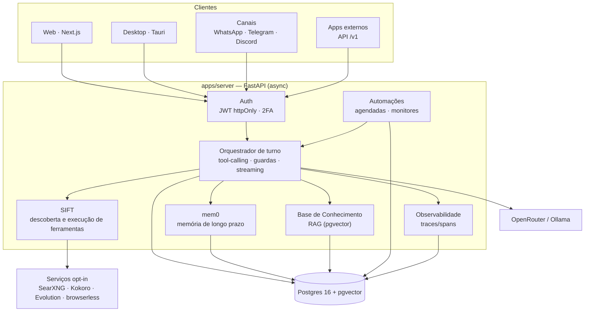
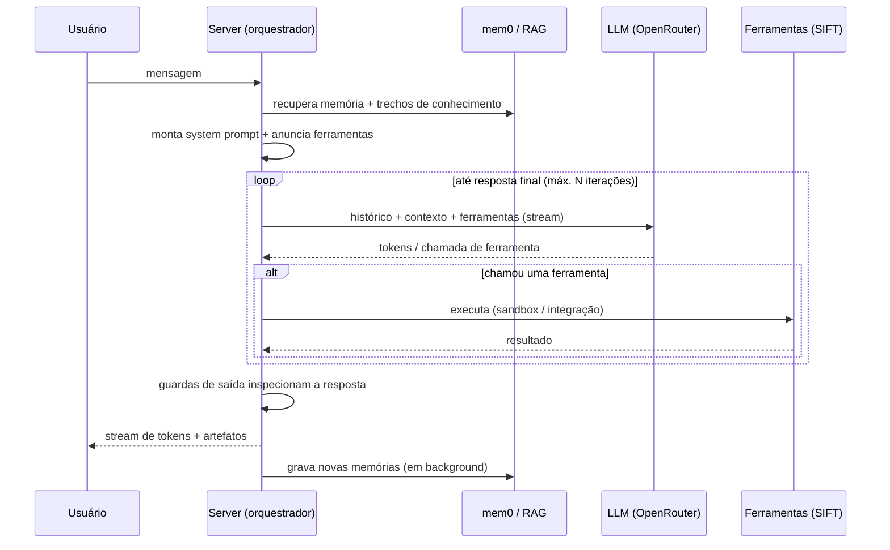

# Arquitetura

O AI Workspace é um monorepo com um **backend FastAPI** (assíncrono), um **frontend Next.js** e
um **shell desktop Tauri**, orquestrados por **Docker Compose** e apoiados em **Postgres 16 com
pgvector** para dados relacionais e vetoriais.

## Visão geral

## Componentes

### Backend (`apps/server`)

FastAPI assíncrono, servido por Uvicorn. Responsabilidades:

- **Autenticação e sessão** — Argon2 para senhas, JWT em cookie httpOnly (access + refresh
  rotativo), 2FA TOTP opcional, RBAC admin/user.
- **Orquestrador de turno** (`chat/orchestrator.py`) — monta o contexto (memória + RAG + chats
  de referência), anuncia as ferramentas, roda o loop agêntico de tool-calling, aplica os
  **guardas de saída** e emite os eventos de streaming. Roda desacoplado da request: F5 ou
  fechar o navegador não cancela a geração.
- **SIFT** — biblioteca de tool-calling (3 meta-ferramentas: buscar, executar, rodar código).
  As ferramentas nativas são injetadas direto; o catálogo é descoberto sob demanda para
  economizar tokens.
- **mem0** — memória de longo prazo com escopos (global/modelo/chat) e bancos compartilháveis,
  usando o mesmo Postgres + pgvector como vector store.
- **Base de Conhecimento (RAG)** — documentos indexados com FastEmbed (384 dim) em pgvector;
  modo automático (injeta trechos + cita) ou ferramenta (`search_knowledge`).
- **Integrações** — Google (Gmail/Agenda), Tuya/Smart Life, GitHub, e os canais
  (WhatsApp/Telegram/Discord).
- **API pública** (`/v1`) — endpoints compatíveis com OpenAI + gestão de chaves.
- **Observabilidade** — cada requisição vira um trace; spans medem tempo de banco, LLM e
  ferramentas.

O código das rotas é dividido em ~34 routers (`main.py` os registra). A configuração central
vem de variáveis de ambiente via `pydantic-settings` (ver [configuration.md](configuration.md)).

### Frontend (`apps/web`)

Next.js 14 (App Router) + React 18 + Tailwind. É uma **imagem buildada** (`next start`), não
dev server — mudanças na UI exigem `docker compose build web`. A URL da API é derivada do host
da página por padrão (`window.location:8000`), então o mesmo build funciona por localhost, IP
da LAN e VPS sem rebuild. É também um **PWA** com layout responsivo para mobile.

### Desktop (`desktop`)

Shell Tauri (Rust) que carrega a **mesma interface web** numa janela nativa, acrescentando
bandeja, "rodar em segundo plano" e "iniciar com o Windows". Ver [desktop.md](desktop.md).

### Banco de dados

Um único **Postgres 16 + pgvector** guarda tudo: dados relacionais (usuários, chats,
mensagens, modelos, automações…), os **vetores do mem0** e os **embeddings do RAG**. O schema
evolui por **55 migrações Alembic**, aplicadas automaticamente no startup do servidor.

## Ciclo de vida de um turno de chat

Detalhes de custo/uso (tokens, origem de cada parte do prompt) são registrados por resposta no
ledger de uso e visíveis na **Analítica**; a latência de cada etapa aparece na
**Observabilidade**.

## Serviços opcionais (profiles)

Recursos pesados ficam em serviços separados que só sobem sob demanda:

| Profile    | Serviço      | Papel                                                   |
|------------|--------------|---------------------------------------------------------|
| `search`   | SearXNG      | Metabuscador self-hosted para a pesquisa na web         |
| `voice`    | Kokoro       | TTS/STT local compatível com OpenAI                     |
| `whatsapp` | Evolution    | WhatsApp não oficial (QR Code)                          |
| `browser`  | browserless  | Chromium headless controlado pela IA (tool de navegação)|

## Volumes persistidos

| Volume                 | Conteúdo                                              |
|------------------------|------------------------------------------------------|
| `pgdata`               | Dados do Postgres (inclui vetores e embeddings)      |
| `mlcache`              | Modelos de embedding (FastEmbed/HF) + índices SIFT   |
| `codespace_data`       | Cópias de trabalho dos projetos do Codespace + grafo |
| `evolution_instances`  | Sessões do Evolution (WhatsApp)                       |
