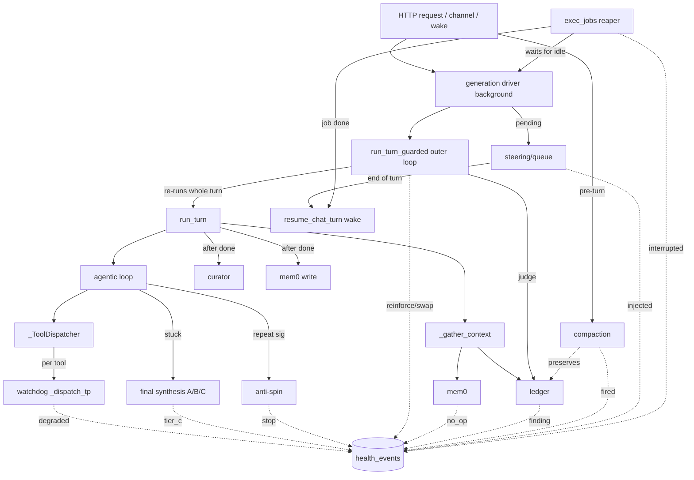

# Harness coupling — how the layers interact & fail together

The [turn pipeline](turn-pipeline.md) maps **one turn, in order**. This page is the
**cross-cutting** view: the mechanisms that wrap, observe, or outlive a turn, how they
**depend on each other**, and — the point — the failures that **emerge between** layers
rather than inside any one of them. The `mem0 → silent no-op` incident was exactly this:
no single layer was buggy; a config field one layer added was rejected by another, and a
third (memory) degraded silently because nothing watched the seam.

Read this before adding a new tool, service, guard, or background worker. The
[maintenance checklist](#maintenance-checklist) at the end is the short version.

> Anchors are `file::symbol` (line numbers drift). Companion docs:
> [turn-pipeline.md](turn-pipeline.md) (sequential), [architecture.md](architecture.md)
> (components).

---

## The layers (cross-cutting mechanisms)

| Layer | Where | Scope | Outlives the turn? |
|---|---|---|---|
| **run_turn** | `chat/orchestrator.py::run_turn` | the agentic loop itself | no |
| **Output guards** | `orchestrator::run_turn_guarded` | OUTER retry loop around run_turn | no |
| **Anti-spin + final synthesis** | inside run_turn (`_absorb`, `_final_synthesis`) | rescue a stuck loop | no |
| **Tool watchdog** | `orchestrator::_ToolDispatcher._dispatch_tp` | per builtin tool-call | thread may leak past turn |
| **Steering / queue** | `chat/generation.py::Generation.pending` + `run_turn` steer drain | inject/continue on user input mid-turn | queue → next turn |
| **Guard-judge** | output guard `detect="judge"` + `ledger_service.render_block` | grounds the final answer against the ledger | no |
| **Curator** | `chat/curator.py` (every N turns, opt-in) | proposes skills / curates memory | background, after done |
| **Compaction** | `chat/compaction_service.py::maybe_autocompact` | pre-turn context control | mutates history durably |
| **Ledger** | `chat/ledger_service.py` | task state ACROSS turns & compaction | yes (DB) |
| **Generation driver** | `chat/generation.py::start` | decouples generation from the HTTP request | yes (background task) |
| **exec_jobs** | `codespace/exec_jobs.py` | long background commands + wake | yes (subprocess + DB) |
| **Health / observability** | `health_service.py`, `models/health_event.py` | watches every layer's degradation | yes (DB) |
| **mem0 (memory)** | `memory/mem0_service.py` | reads/writes long-term memory | background write |
| **codegraph** | `codespace/graph_service.py` (taint/reaches) | static analysis with time budget | thread |

---

## Coupling map

Solid edges = control flow. Dotted edges = **observation** (health instrumentation) —
one-way, fire-and-forget, never feeds back into control flow.

---

## The three hard couplings (break these and things break silently)

### 1. DB sessions × event loops — the #1 trap

There are **three** DB-access regimes and mixing them causes
`Future attached to a different loop` or silent loss. Pick by **where the code runs**:

| Runs on | Use | Examples |
|---|---|---|
| The **request** (FastAPI handler) | the injected `db: AsyncSession` (`get_db`) | routes |
| The **main loop**, no request session | global `SessionLocal` / `engine` (`db.py`) | `run_turn`, generation driver, `ledger_service.load`, `recover_orphans` |
| A **tool** (SIFT threadpool + `asyncio.run`) | an **ephemeral `NullPool` engine per call**, OR **sync psycopg2** | see below |

Why: the global async `engine` binds its pooled connections to the loop that created
them (the main loop). A SIFT tool runs in a threadpool and calls `asyncio.run(...)`,
which spins up a **new loop each call**. Touching the global `SessionLocal` from there
reuses a connection bound to another loop → crash.

**Tool-context DB access must therefore either:**
- create an ephemeral engine per operation:
  `create_async_engine(url, poolclass=NullPool)` → `async_sessionmaker` → use → `dispose`.
  Used by `codespace/graph_service.py`, `chat/ledger_service.py` (tool path),
  `investigation_service.py::_session`.
- or use **sync psycopg2** (no event loop at all): `health_service.py`,
  `codespace/exec_jobs.py` persistence, `mem0_service.py` flag writes.

> The `ledger_service.load` docstring is the canonical note: same module uses the global
> `SessionLocal` when called from the main loop (`run_turn`) and an **ephemeral** engine
> when called from a tool. Same data, two regimes, chosen by caller context.

### 2. Observation must never take down the observed

Health instrumentation and durable-state persistence are **fire-and-forget**:

- **sync, never raises** — `health_service.record` and `exec_jobs._db_insert/_db_update`
  wrap everything in `try/except` and only `logger.warning` on failure. A failed
  health write must never break the tool that was degrading.
- **never blocks the event loop** — the write is **sync psycopg2** (connect+insert,
  `connect_timeout=10s`). Called **from the main loop** that's a stall risk: a slow DB
  freezes the loop up to the timeout, *precisely* when health events fire (degradation).
  So main-loop async call sites use **`health_service.record_bg`** — it offloads the
  sync write to a thread (`run_in_executor`, keeping a ref in `_bg_pending` so the GC
  doesn't drop the pending future) and returns immediately; with no running loop it
  falls back to sync `record`. The `exec_jobs` reaper offloads its `_db_update` the same
  way (`await run_in_threadpool`). Sync-context callers (mem0/exec reader threads, boot
  self-check, `recover_orphans`, the ledger tool loop) stay on plain `record` — there's
  no main loop there to protect, and tests rely on its synchronous completion.
- **lazy import at the call site** — `from .. import health_service` *inside* the
  degradation branch, not at module top. `health_service.self_check` imports
  `mem0_service` lazily; `mem0_service` records health lazily → no import cycle.
- **rare by design** — events fire on degradation/primitive-action, not per-token.

Consequence: if you add a degradation point, the health call goes in the `except`/fallback
branch, lazily imported, its own failure swallowed — and if the call site runs on the
**main loop**, use `record_bg`, not `record`.

### 3. A layer that inspects sits AFTER its target (`y → guard → x`)

Every guard/observer runs **downstream** of what it checks, so a symptom surfaces at the
guard while the cause lives upstream:

- **Output guard** sees only the **final** text — after the whole loop + synthesis ran.
  "Answer keeps re-running" is the *guard*; the wrong answer's cause is the loop/tools.
- **Final synthesis** runs only *after* the loop failed to produce text — "got a
  deterministic digest" means the model was format-locked upstream.
- **Health snapshot** shows *effects* (mem0 no_op) whose *cause* is elsewhere (a config
  field). The alarm points at the seam, not the culprit.

Debug rule: when a wrapper misbehaves, look one layer **in**, not at the wrapper.

---

## Emergent failure modes (cross-layer)

These are the interactions to keep in your head — none is a single-layer bug.

| Interaction | What can go wrong | What contains it |
|---|---|---|
| **config field × mem0 build** | one layer adds a param the mem0 `MemoryConfig` rejects → mem0 falls to no-op **silently** | boot self-check + `memory/no_op` alarm (frente 1); the `_build_config` filters `connect_timeout` before passing to mem0 |
| **output guard × final synthesis** | guard re-runs the WHOLE turn; if synthesis always falls to tier C and the guard always triggers, retries burn | `_GUARD_HARD_CAP` + per-guard `max_retries`; tier_c is alarmed so you SEE it |
| **watchdog × anti-spin** | a hung tool aborts with an error result; the error feeds the anti-spin signature and can trip "stop" if it repeats | intended — repeated identical failure *should* stop; both emit health events |
| **watchdog thread leak × executor** | an abandoned tool thread keeps running (Python can't kill threads); N hangs could exhaust the default executor | far rarer than the old "1 tool hangs the turn forever"; codegraph now self-bounds via `deadline_ms` so it rarely reaches the watchdog |
| **watchdog offload × turn contextvars** | switching the tool offload from `run_in_threadpool` (copies context) to `run_in_executor` (does **not**) silently dropped every `toolctx` contextvar inside the tool → `current_codespace_project_id`/`current_chat_id`/`user_tz`/`background` read their defaults; a real project chat got "Nenhum projeto vinculado". A mechanism swap in one layer broke an implicit coupling in a distant one (toolctx) | `_dispatch_tp` now `copy_context()` + `functools.partial(ctx.run, dispatch, …)`; regression test `test_tool_context_propagation.py` locks it. Rule: **any threadpool→executor swap must re-establish contextvar propagation** |
| **self-bound wait × watchdog** | `code.exec.jobs`/`code.preview.serve` `action=wait` block ON PURPOSE with their OWN ceiling (≤1200s / ≤240s), but the 120s dispatcher watchdog killed them — so you could NEVER wait for a build/server to come up (the Metabase chat: 6 waits killed at 120s, ~12 min wasted). Two bounds on the same call, the tighter one wrong | `_dispatch_tp` exempts `_SELFBOUND_WAIT_TOOLS` action=wait from the watchdog (they self-bound + return gracefully). Rule: **a tool that legitimately blocks long needs a watchdog exemption, not a 120s cap** |
| **server × background-job/wake** | a dev server never COMPLETES; the bg-job wake fires on completion, so launching a server via `code.exec.run` (backgrounded) meant the wake would never come — the model "monitored" a job that couldn't finish and promised an auto-continue that couldn't happen | `code.exec.run` refuses server commands (`_looks_like_server`) and redirects to `code.preview.serve`; previews get their own **readiness wake** (`watch_ready`+`_ready_poller`) that fires on up/crashed. Rule: **completion-wake is for jobs; servers need a readiness-wake** |
| **compaction × ledger** | compaction removes old history; anything the model needed from it is gone | the **Ledger** survives outside history — it's the coupling that makes compaction safe. Never store turn-critical state only in the message log |
| **steering × tool re-open** | steering injected in the final (tool-stripped) rounds would have no tools to act with | `run_turn` re-opens `tools = _base_tools` when a steer drains |
| **exec_jobs wake × active generation** | waking a chat that's still generating = two concurrent generations (race) | `_maybe_wake` waits for `generation.get_active` to be idle before firing; the send-during-gen path routes to `enqueue` |
| **exec_jobs restart × recovery double-fire** | boot recovery could mark a job that the *new* process just started | `recover_orphans` filters `job_key not in _jobs` (current-process guard) |
| **generation driver × request session** | the background driver outliving the request must not touch the request-scoped `db` | setup (`_prepare_turn` + `_resolve_*`) resolves everything into self-contained dicts **in the request** |
| **curator/mem0 write × done latency** | post-turn work (memory write, curator) blocking the visible `done` | both run in **background** after the `done` is emitted; never awaited inline |
| **graceful vs hard restart** | SIGTERM: `generation.shutdown` saves partials, exec_jobs recovered next boot. SIGKILL/OOM 137: partials lost | generation shield covers SIGTERM; exec_jobs recovery covers **all** restart types (it reads DB state, not process state) |

---

## Lifecycle coupling: what survives a restart

| State | In memory | Durable? | On restart |
|---|---|---|---|
| Active generation | `generation._active` | partial saved on SIGTERM (shield) | graceful: partial persisted with interrupted note; hard kill: lost |
| Background exec job | `exec_jobs._jobs` | **yes** (`codespace_exec_jobs`, frente 3) | subprocess dies; `recover_orphans` marks `interrupted` + **wakes the chat** |
| Pending wake | implicit (job `settled=False`) | **yes** (job row) | recovered as above — kills the "wake that never comes" |
| Ledger / compaction | — | **yes** (DB) | intact |
| Health events | — | **yes** (DB) | intact; self-check re-runs at boot |
| Preview servers | `preview_service` registry | no | dev servers die; user restarts them |

The rule frente 3 established: **in-memory registries of owed work must have a DB shadow
and a boot reaper** that turns silent loss into graceful, announced recovery. Generation
already had this (shielded shutdown); exec_jobs got it; preview is acceptable to drop
(the user explicitly restarts a preview).

---

## Maintenance checklist

When you add to the harness, honor the couplings:

- **New SIFT tool that touches the DB?** Use an ephemeral `NullPool` engine or sync
  psycopg2 — **never** the global `SessionLocal` from the tool's `asyncio.run`
  (coupling #1).
- **Changing how a tool is offloaded to a thread?** `run_in_threadpool` copies the
  `contextvars.Context`; `run_in_executor` does **not**. Any swap to `run_in_executor`
  must `copy_context()` and run the callable via `ctx.run` (`_dispatch_tp` pattern), or
  every `toolctx` value reverts to its default inside the tool — silently.
- **New degradation / fallback path?** Instrument it in the `except`/fallback branch,
  **lazily imported**, never raising (coupling #2). On the **main loop** use
  `health_service.record_bg` (offloads the sync psycopg2 write); only in a sync/worker
  context use plain `record`. If it's a primitive, add its name to
  `health_service._PRIMITIVES`.
- **New output guard or wrapper?** Remember it sees only the **final** text and re-runs
  the whole turn; budget its retries (coupling #3) and don't assume it can see loop
  internals.
- **New background worker that owns pending work?** Give it a DB shadow + a boot reaper
  (frente 3 pattern); mark work `settled` when delivered; guard the reaper against
  current-process items.
- **New post-turn work?** Run it in the **background** after `done`; never block the
  visible completion (curator/mem0-write pattern).
- **New context source?** Add it in `_gather_context` / the **tail** of the system
  message — never in the cached prefix (breaks prompt caching; see turn-pipeline).
- **Anything that must survive compaction?** Put it in the **Ledger**, not the message
  history.
- **Touching mem0 config?** The `MemoryConfig` rejects unknown fields — filter before
  passing (the `connect_timeout` lesson). The boot self-check will alarm if you break it,
  but catch it in review.
